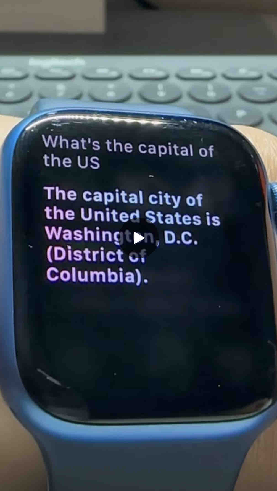
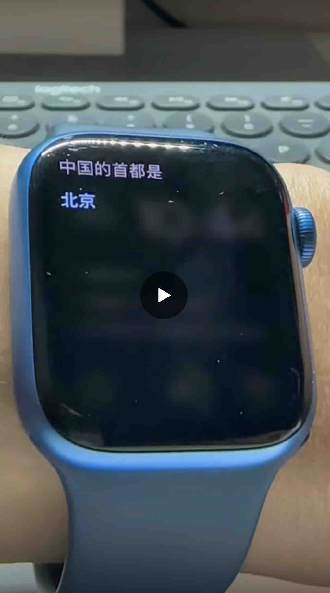
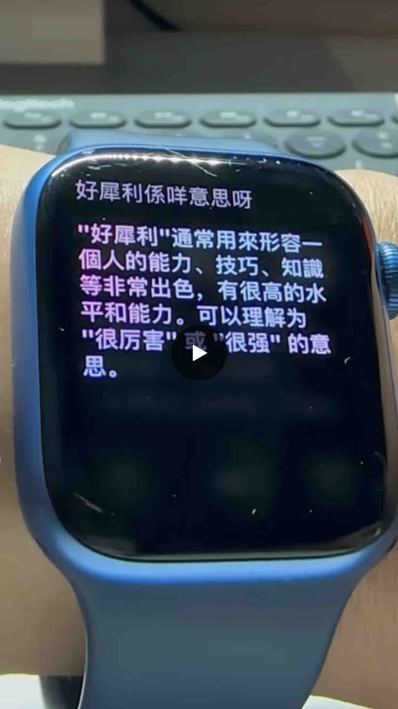

# AskAI

An iOS Shortcut that allows hands-free Apple Watch conversations with AI, utilizing the OpenAI API. 

## Requirement:

* Apple Watch (It works on other Apple devices too. But the hands-free focus works best on Apple Watch.)
* An OpenAI API key.

To obtain an OpenAI API key, log in to your account and find it [here](https://platform.openai.com/account/api-keys). If you don't have an account, [sign up](https://platform.openai.com/signup) for one. As of March 26, 2023, the cost for using the `gpt-3.5-turbo` model is $0.002 per 1,000 tokens, with 1,000 tokens equating to roughly 750 words. For example, if you asked, `What is the capital of the US?` and received the answer `Washington D.C.` that would amount to 13 tokens, or $0.000026.

## Demos

  
  
  

## AskAI 1.1 (Downloads: [English](https://www.icloud.com/shortcuts/18a915c6b18245cfb1b06f38fae6737d) / [普通话](https://www.icloud.com/shortcuts/2f25b12169134be682b9a35a8b80b01e) / [廣東話](https://www.icloud.com/shortcuts/b8f72a91656240c596c83061a3da28a8))
* Enable conversation style, which means that follow-up questions take into account the previous context.

## AskAI 1.0
* using the `gpt-3.5-turbo` model (the cheapest and no waitlist as of now)

